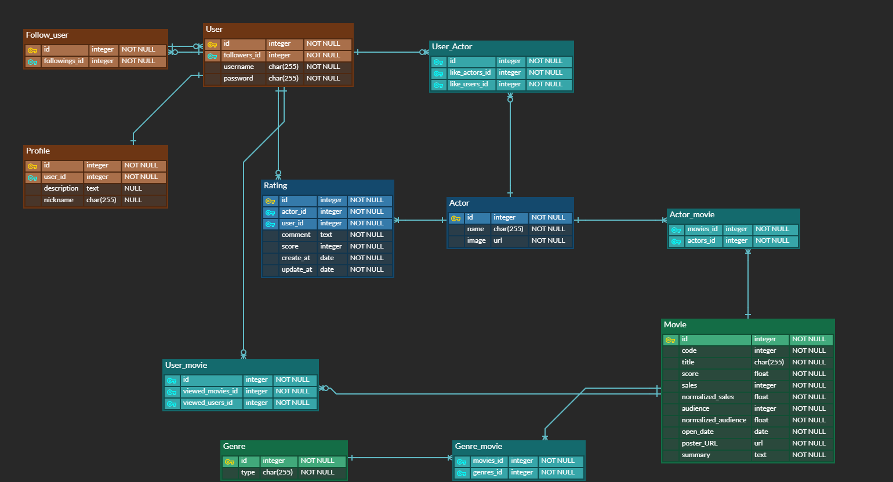

# ebaeu(SSAFY 최종 프로젝트)

## i. 팀원 정보 및 업무 분담 내역

- 김종민([gitlab](<https://lab.ssafy.com/HorangApple/>))
  - UI 개발
  - django 개발
- 민두홍([gitlab](<https://lab.ssafy.com/doohong91/>))
  - UI 개발
  - 데이터 크롤링
  - django 개발

## ii. 목표 서비스 구현 및 실제 구현 정도

- 기능
  - 배우가 출연한 영화들의 정보(평점, 누적관객수, 매출액)을 기준으로 점수를 매겨 평가하는 사이트
  - 이 배우는 믿고 영화를 볼 수 있는 배우인지 판단하는데 도움을 주는 서비스를 목표
  - 배우가 출연한 영화들의 list를 보여줌
  
- 요구사항
  - 최근 10년 이내의 한국 영화데이터 
  - 영진위 API를 통해 영화 정보 수집(영화명, 장르, 배우, 누적관객수, 매출비율)
  - Naver 영화 API를 통해 영화 평점, 포스터 수집


## iii. 데이터베이스 모델링




## iv. 핵심 기능

### i) 배우 평점

배우가 찍은 영화들의 **영화 평점**, **누적관객수**, **매출액**을 이용해 배우의 평점을 매기는 기능입니다.

*actors/models.py*

```python
from django.db import models
from django.conf import settings
from django.db.models import Avg
# Create your models here.

class Actor (models.Model):
    name = models.CharField(max_length=255)
    image = models.URLField(max_length=255)
    like_users = models.ManyToManyField(settings.AUTH_USER_MODEL, related_name='like_actors', blank=True)

    @property
    def get_point(self):
        avg_score = self.movies.aggregate(Avg('score'))['score__avg'] if self.movies.aggregate(Avg('score'))['score__avg'] else 0
        avg_aud = self.movies.aggregate(Avg('normalized_audience'))['normalized_audience__avg'] if self.movies.aggregate(Avg('normalized_audience'))['normalized_audience__avg'] else 0
        avg_sales = self.movies.aggregate(Avg('normalized_sales'))['normalized_sales__avg'] if self.movies.aggregate(Avg('normalized_sales'))['normalized_sales__avg'] else 0
        return sum([avg_score*5, avg_aud*3, avg_sales*3])/11

...
```

하나의 column 선택해 계산해주는 django ORM의 `aggregate`를 이용하여 세 가지 요소를 각각 평균을 내었고 이를 별도의 가중치를 반영하였습니다. 여기서 model `movies`의 `normalized_audience`와 `normalized_sales`는 크롤링하는 작업 단계에서 10점 만점인 평점과 맞추기 위해 최대값 10으로 스케일을 변환시킨 값입니다. 계산 결과 값은 model에 저장되지 않지만 `get_point`이름의 속성으로 접근할 수 있습니다.

### ii) 년도별 평점순 배우 정렬 및 검색 기능


선택한 년도를 기준으로 평점이 높은 순으로 배우 10명을 정렬합니다. 또한 배우 이미지를 클릭하면 해당 배우가 출연한 영화 리스트를 보여주는 페이지로 이동합니다.

*actors/views.py*

```python
...
from django.db.models import Count, Case, When, F
...

def index(request):
  query = request.GET.get('q')
  sort = request.GET.get('sort')
  if query: # 검색창을 통한 배우 검색
    actors = Actor.objects.filter(name__icontains = query)
  else: # 년도별 평점순 배우 정렬
    if not sort:
      # default는 2017년 기준으로 출력
      sort = 2017
    actors = Actor.objects.annotate(
      movie_count=Count(
        Case(
          When(movies__open_date__year__in = range(int(sort), 2020), then=F('movies'))
        )
      )
    ).filter(movie_count__gte=3)
    actors = sorted(actors, key=lambda x:x.get_point, reverse=True)[:10]
  return render(request,'actors/index.html',{'actors': actors, 'years': range(2010, 2020)})
...
```

*actors/templates/actors/index.html*

```html
...

    <button onclick="location.href='{{ request.path }}?sort={{ year }}'" type="button" class="btn btn-dark">{{ year }}</button>

...
```

`index.html`에서 년도(`sort`)를 받아 django ORM의 `annotate`을 이용하여 정렬을 시킵니다. annotate는 하나의 column을 만들고 거기에 매개변수를 바탕으로 내용을 추가시키는 메서드입니다. Actor의 movies의 open_data 속성(date 형식)의 year를 가지고 와서 sort와 2020사이에 해당되는 movies를 골라 count 합니다. annotate를 통해 생성된 `movie_count`가 3보다 같거나 큰 배우만 골라 냅니다. 이후 `sorted`를 통해 평점이 높은 순으로 정렬을 하고 10명까지 뽑아 render에 반영합니다.


*templates/nav.html*

```html
...
<form class="form-inline my-2 my-lg-0" action="" method="get">
  <input class="form-control mr-sm-2" type="search" placeholder="배우를 검색해 보세요" aria-label="Search" name='q'>
  <button class="btn btn-outline-success my-2 my-sm-0" type="submit">Search</button>
</form>
...
```

*actors/views.py* 에서 query를 받으면 `filter`를 통해 해당 배우를 검색하고 이를 render를 통해 반영합니다.

### iii) 영화 추천


*actors/views.py*

```python
...
@login_required  
def recommand_movie(request):
  user=request.user
  like_actors=user.like_actors.all()
  return render(request,'actors/recommandMovie.html',{'like_actors':like_actors})
...
```

해당 유저가 '좋아요'를 누른 배우들을 기반으로 배우들이 찍은 영화들을 출력합니다. 영화 포스터를 누르면 영화평점, 누적관객수, 매출액과 줄거리를 담은 modal이 출력됩니다.

### iv) 배우 추천


*actors/views.py*

```python
...
@login_required
def recommand_actor(request):
  viewed_movies=request.user.viewed_movies.all()
  return render(request,'actors/recommandActor.html',{'viewed_movies':viewed_movies})
...
```

해당 유저가 '봤어요'를 누른 영화들을 기준으로 영화를 찍은 배우들을 출력합니다. 배우 추천 페이지에서 곧바로 좋아요를 누를 수 있고 배우 이미지를 클릭하면 해당 배우가 출연한 영화 리스트를 보여주는 페이지로 이동합니다.

### v) 댓글 CRUD

배우에 대한 평점과 댓글을 달 수 있는 기능을 구현하였습니다.


*actors/views.py*

```python
from django.contrib.auth.decorators import login_required
from django.contrib.auth import get_user_model
from .models import Actor, Movie, Genre, Rating
from .forms import RatingForm, ActorForm
...
@login_required
@require_POST
def create_rating(request, actor_id):
  form = RatingForm(request.POST)
  if form.is_valid():
    rating = form.save(commit=False)
    rating.user = request.user
    rating.actor_id = actor_id
    rating.save()
  return redirect('actors:detail', actor_id)
  
  
@login_required
def update_rating(request, actor_id, rating_id):
  rating = get_object_or_404(Rating, id=rating_id)
  if request.method == 'POST':
    if rating.user == request.user:
      form = RatingForm(request.POST, instance=rating)
      if form.is_valid():
        form.save()
    return redirect('actors:detail', actor_id)
  else:
    form = RatingForm(instance=rating)
    actor = get_object_or_404(Actor,pk=actor_id)
    return render(request,'actors/detail.html',{'actor':actor, 'form': form})


@login_required
@require_POST
def delete_rating(request, actor_id, rating_id):
  rating = get_object_or_404(Rating, id=rating_id)
  if rating.user == request.user:
    rating.delete()
  return redirect('actors:detail', actor_id)
```


## v. 배포 서버 URL

https://ebaeu.herokuapp.com/

## vi. 기타(느낀점)

django template 문법을 위주로 작성하였는데 javascript로 비동기 통신을 사용하지 않다보니 보다 더 좋은 사용자 환경을 제공하지 못하여 많이 아쉬웠습니다. 

페이지를 디자인하는 것이 어려웠습니다. UI를 꾸미는 데에 있어서 어떻게 해야 독창적으로 이쁘게 꾸밀 수 있을까라는 고민을 하였지만 큰 욕심을 부리지 않기로 결정하였습니다.

배우를 데이터 크롤링을 할 때 생긴 애로사항은 동명이인의 배우들과 프로필 사진이 없는 무명 배우들 등 겹치거나 값이 하나라도 없으면 꼬이는 경우가 종종 발생하였습니다. 또한 네이버 api가 영화이름으로 검색하는 방식으로 되어있다보니까 원하지 않은 동명의 영화들이 검색되어 되었습니다. 이 때문에 복잡한 쿼리를 설계해야 했고 크롤링 하는 시간도 늘어나게 되었습니다.

충분한 개발 기한과 개발 능력이 없다면 참으로 고통스럽구나를 느낀게 가장 크다고 생각합니다. 물론 충분한 개발 능력이 있다면 이번에 주어진 4일 내에 개발을 완료할 수 있겠지만 javascript와 Vue.js에 익숙하지 않은 상황에서 작업하려고 하니 힘들었습니다.